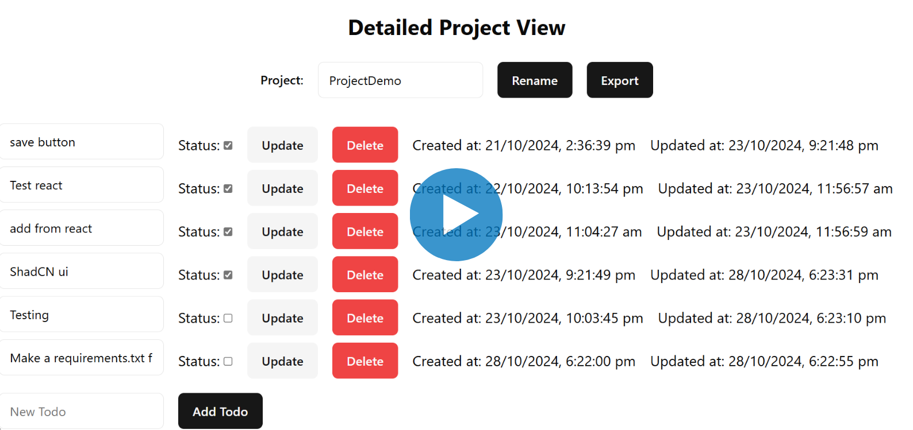

# ToDo
 
A full stack web application to manage Project ToDos. Frameworks, Libraries and Tools used:<br>
**Back-end**: FastAPI with PostgreSQL database.<br>
**Front-end**: React.js with Tailwind css and ShadCN Ui.<br>
This project is done as a Hatio take home challenge.


### Watch the Demo Video:
[](https://drive.google.com/file/d/1ec39eCgKm5PZa_ikjX5s8T1mnHwOnL0E/preview)

## Features

1. **User Registration**- Sign Up with unique credentials. Passwords are hashed before being stored in the database.
2. **User LogIn**- Log in using your credentials. A JWT is returned for authorized access.
3. **Project Creation**- Create a new Project with the Title you specify.
4. **View all Projects**- In the Home page, you can view all the Projects you created.
5. **Detailed Project View**- Click on a Project to see it's details including tasks(todos) for that project.
6. **Rename Project**- Rename your Project from the Detailed Project View page.
7. **Todo Creation**- Add a new Todo by providing a Description.
8. **Update Description**- Change the Description for an existing Todo, then click Update.
9. **Update Status**- Mark a ToDo as complete or pending using the checkbox, then click Update.
10. **ToDo Deletion**- Delete a ToDo by clicking the Delete button.
11. **Export as Gist**- Download a <project_name>.md file containing Summary of the Project.
 

## Setup

To run the web app in your machine, download the code ZIP file or clone this repository.<br>
Open a terminal and change directory to `ToDo`.
```bash
git clone https://github.com/notalanjoseph/ToDo.git
cd ToDo
```

### 1. Front-end

- **Node.js**: Download and install version 14 or newer from [Nodejs.org](https://nodejs.org/).
- Install dependencies and Run the server using the commands:
    ```bash
    cd ToDo-Pages
    npm install
    npm run dev
    ```
    The react app will be running at `http://localhost:5173`. Access it using a web browser.

### 2. Database

- **PostgreSQL**: Download version 13 or newer from [PostgreSQL.org](https://postgresql.org/). Install all the components during the installation.
- **Password**: During installation, set the database superuser(postgres) password as `root`. If you want to use another password, define it in the .env file.
    ```bash
    database_password=your_database_superuser_password
    ```
<!-- - **Create server**: Open pgAdmin 4 and click on `Server` -> `Register Server`. Set Name as `local postgres`, Host name as `localhost`. Use same password as before. Click Save. -->
- **Access server**: Open pgAdmin4 and click on `Servers` from the left sidebar. Access the existing server (eg- `PostgreSQL 18`) using the password from before.
- **Create database**: Right click on `Databases` -> `Create` -> `Database`. Set Database name as `ToDoDB`. Click Save.
- **Create tables**: Right click on `ToDoDB` -> `Query Tool`. Copy & paste the below queries one by one and execute by pressing `F5`:
    ```bash
    CREATE TABLE IF NOT EXISTS public.users
    (
        id serial NOT NULL,
        email character varying(25) COLLATE pg_catalog."default",
        password character varying COLLATE pg_catalog."default" NOT NULL,
        created_at timestamp with time zone NOT NULL DEFAULT now(),
        CONSTRAINT users_pkey PRIMARY KEY (id),
        CONSTRAINT users_email_key UNIQUE (email)
    )
    TABLESPACE pg_default;
    ALTER TABLE IF EXISTS public.users
        OWNER to postgres; 
    ```
    ```bash
    CREATE TABLE IF NOT EXISTS public.projects
    (
        id serial NOT NULL,
        title character varying(25) COLLATE pg_catalog."default" NOT NULL,
        owner_id integer NOT NULL,
        todos integer[],
        created_at timestamp with time zone NOT NULL DEFAULT now(),
        CONSTRAINT projects_pkey PRIMARY KEY (id),
        CONSTRAINT projects_owners_fkey FOREIGN KEY (owner_id)
            REFERENCES public.users (id) MATCH SIMPLE
            ON UPDATE NO ACTION
            ON DELETE CASCADE
    )
    TABLESPACE pg_default;
    ALTER TABLE IF EXISTS public.projects
        OWNER to postgres;
    ```
    ```bash
    CREATE TABLE IF NOT EXISTS public.todos
    (
        id serial NOT NULL,
        description character varying(50) COLLATE pg_catalog."default" NOT NULL,
        status boolean NOT NULL DEFAULT false,
        created_at timestamp with time zone NOT NULL DEFAULT now(),
        updated_at timestamp with time zone NOT NULL DEFAULT now(),
        CONSTRAINT todos_pkey PRIMARY KEY (id)
    )
    TABLESPACE pg_default;
    ALTER TABLE IF EXISTS public.todos
        OWNER to postgres;
    ```


### 3. Back-end

- **Python**: Download and install a version between 3.8 and 3.11 from [Python.org](https://python.org/). Check Python & pip installation:
    ```bash
    python --version
    pip --version
    ```
- **Dependencies**: Install the required Python packages listed in `requirements.txt`:
    ```bash
    cd ToDo-App
    pip install -r requirements.txt
    ```
- **Start server**: Run the FastAPI backend with uvicorn. The server will start on `http://localhost:8000`.
    ```bash
    uvicorn app.main:app --reload
    ```


## API endpoints details

After starting the FastAPI server with uvicorn, go to `http://127.0.0.1:8000/docs` to see the request and response associated with each endpoints.
